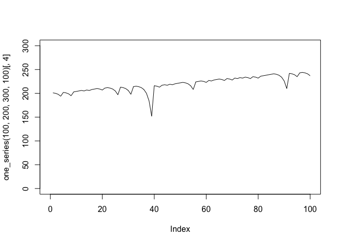
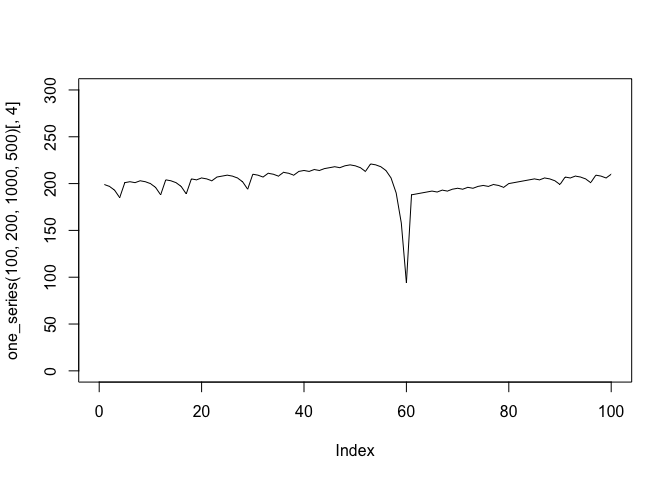

## How does Roulette work?

Roulette is a popular casino game that involves a spinning wheel with
numbered pockets and a small ball. Players place bets on where they
think the ball will land once the wheel stops spinning. The roulette
wheel is divided into numbered pockets.There are 38 pockets of which 2
are green, 18 are red, and 18 are black. The numbers are not arranged in
numerical order on the wheel. Players place their bets on individual
numbers, groups of numbers, whether the number will be odd or even, red
or black, and other combinations.

## What is the “Martingale” strategy?

The strategy is based on the concept of doubling your bet after every
loss in order to recover previous losses and potentially make a profit.
The player starts by placing an initial bet on an outcome. If the
player’s initial bet wins, they collect their winnings and start again
with the original bet amount.If the player’s initial bet loses, they
double their bet for the next round. If the player continues to lose,
they keep doubling their bet after each loss until they eventually win.
When the player finally wins a bet, they recover all of their previous
losses plus the original bet amount. After a win, the player starts
again with the initial bet amount.

## To better understand how successful the Martingale strategy tends to be we will be utillizing the following simulation:

    martingale_wager <- function(
        previous_wager
      , previous_outcome
      , max_wager
      , current_budget
    ){
      if(previous_outcome == 1) return(1)
      min(2*previous_wager, max_wager, current_budget)
    }

    profit <- function(l1) l1[nrow(l1),4] - l1[1,1]

    one_series <- function(ng, sb, wt, mw){
    # ng = max number of spins
    # sb = starting budget
    # wt = ending budget (starting budget + winning threshold)
    # mw = max wager
      l1 <- matrix(NA_integer_,nrow=ng,ncol=4)
      l1[,3] <- rbinom(ng,1,18/38)
      l1[1,1] <- sb
      l1[1,2] <- 1
      l1[1,4] <- ifelse(l1[1,3]==1, sb + 1, sb - 1)

      for(i in 2:ng){
        w <- martingale_wager(l1[i-1,2], l1[i-1,3], mw, l1[i-1,4])
        e <- ifelse(l1[i,3]==1, l1[i-1,4] + w, l1[i-1,4] - w)
        s <- e <= 0 | e >= wt
        l1[i,c(1,2,4)] <- c(l1[i-1,4], w, e)
        if(s) break
      }
      l1[1:i,]
    }

    one_series(100,200,300,100)[,4] |> plot(type = "l", xlim = c(0,100), ylim = c(0,300))

## Simulation Explained: The code for this simulation can be explained by dividing it into three chunks. The first chunk is the function martingale\_wager. This function determine the size of the next wager based on the result of the previous wager. For instance, if the previous outcome was a win then the next wager will be the original wager(1), else it will be twice the last wager. The second chunk is the profit function which determines the profit by taking the ending budget and subracting the initial budget from it. The third chunk is the one\_series function which replicates a series of wagers and stores them in a matrix. It then plots the change in the budget over a series of wagers.

## Now, let us examine how changing the parameters effects the average earnings.

    one_series(100,200,1000,500)[,4] |> plot(type = "l", xlim = c(0,100), ylim = c(0,300))

## In this instance, we changed the ending budget(starting budget+winning threshold) and max wager parameters. This change has a notable adverse impact on average earnings and shows how much easier it is to lose all our money because of a higher max wager.

## The code below has been modified to calculate the average number of plays before stopping. We introduce a counter variable called plays to keep track of the number of plays and it is incremented with each iteration of the loop. After running multiple simulations, the average number of plays before stopping is calculated by dividing the total number of plays by total simulations. The output is printed.

    one_series <- function(ng, sb, wt, mw){
    # ng = max number of spins
    # sb = starting budget
    # wt = ending budget (starting budget + winning threshold)
    # mw = max wager
      l1 <- matrix(NA_integer_,nrow=ng,ncol=4)
      l1[,3] <- rbinom(ng,1,18/38)
      l1[1,1] <- sb
      l1[1,2] <- 1
      l1[1,4] <- ifelse(l1[1,3]==1, sb + 1, sb - 1)

      plays<-1
      for(i in 2:ng){
        w <- martingale_wager(l1[i-1,2], l1[i-1,3], mw, l1[i-1,4])
        e <- ifelse(l1[i,3]==1, l1[i-1,4] + w, l1[i-1,4] - w)
        s <- e <= 0 | e >= wt
        l1[i,c(1,2,4)] <- c(l1[i-1,4], w, e)
        if(s) break
        plays<-plays+1
      }
      return(plays)
    }

    num_simulations <- 1000  # Number of simulations
    total_plays <- 0

    for (sim in 1:num_simulations) {
      total_plays <- total_plays + one_series(100, 200, 300, 100)
    }

    average_plays <- total_plays / num_simulations
    cat("Average number of plays before stopping:", average_plays, "\n")

    ## Average number of plays before stopping: 88.844

## It is safe to say that the simulation and the Martingale strategy has its shortcomings. The biggest limitation, in my opinion, is that it relies on the gambler to have an unlimited bank roll to cover his losses. The strategy fails when the gambler eventually loses all his money and is unable to cover his losses. The risk increases exponentially with every loss. The strategy relies on the gambler’s discipline and ability to leave the game after his budget runs out or he hits his winning threshold. Furthermore, the strategy doesn’t change the odds of the game in any way as each spin is an independent event. It should also be noted that the strategy doesn’t account for varied odds due to the participation of other gamblers, etc.
