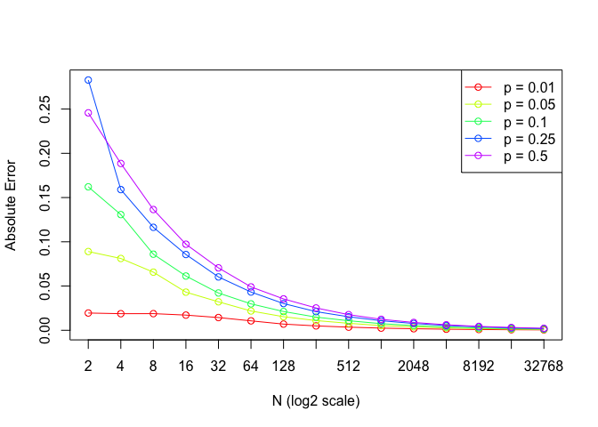
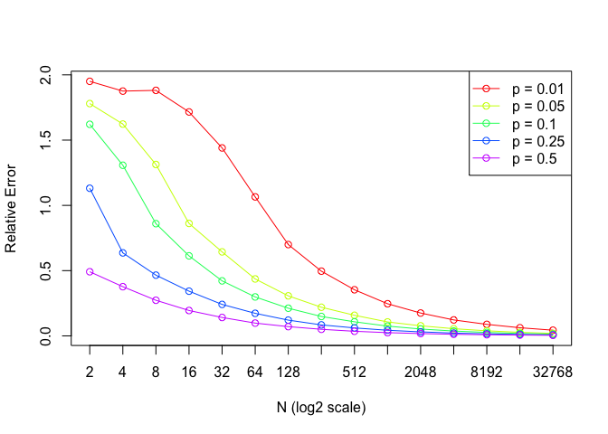

## Simulation Error:

### Simulation generates approximate answers; there is some degree of error in a quantity estimated by Monte Carlo simulation. Intuitively, it seems that the degree of error should get smaller as the number of simulation replicates increases.

### The following code allows us to perform a 14 X 5 factorial experiment simulation that estimates the error for each combination of replicate number (22, 23, …, 215) and probability (0.01, 0.05, 0.10, 0.25, 0.50). The results are visualized in the graphs below and the x axis(N) is on the log base 2 scale.

    error_v4 <- function(r, n, p){
      d1 <- rbinom(r, n, p)
      phat <- d1 / n
      ae <- abs(phat - p)
      re <- ae / p
      c(mean(ae), mean(re))
    }

    # Initialize an empty data frame to store the results
    results <- data.frame(n = numeric(), p = numeric(), ae = numeric(), re = numeric())

    # Set up parameters for the experiment
    r <- 5000  # Constant replicate number
    probs <- c(0.01, 0.05, 0.10, 0.25, 0.50)
    ni <- 2^seq(1, 15, by = 1)

    # Loop through each combination of number of trials (n) and probability
    for (p in probs) {
      for (n in ni){
        # Calculate errors using error_v4 function
       errors <- error_v4(r, n, p)
      
      # Store the results in the data frame
        results <- rbind(results, data.frame(n = n, p = p, ae = errors[1], re = errors[2]))
      }
    }

    ae_results <- results[, c("n", "p", "ae")]
    re_results <- results[, c("n", "p", "re")]

    # Create a new plot
    plot(NULL, xlim = range(results$n), ylim = range(results$ae),
         xlab = "N (log2 scale)", ylab = "Absolute Error", log = "x", xaxt = "n")

    # Generate a color palette
    palette <- rainbow(length(unique(results$p)))

    # Loop through each probability to draw the lines
    for (i in 1:length(unique(results$p))) {
      p_subset <- subset(results, p == unique(results$p)[i])
      lines(p_subset$n, p_subset$ae, type = "o", col = palette[i], log = "x")
    }

    ## Warning in plot.xy(xy.coords(x, y), type = type, ...): "log" is not a graphical
    ## parameter

    ## Warning in plot.xy(xy.coords(x, y), type = type, ...): "log" is not a graphical
    ## parameter

    ## Warning in plot.xy(xy.coords(x, y), type = type, ...): "log" is not a graphical
    ## parameter

    ## Warning in plot.xy(xy.coords(x, y), type = type, ...): "log" is not a graphical
    ## parameter

    ## Warning in plot.xy(xy.coords(x, y), type = type, ...): "log" is not a graphical
    ## parameter

    # Adding a legend
    legend("topright", legend = paste("p =", unique(results$p)), col = palette, lty = 1, pch = 1)

    # Custom axis for log scale
    axis(1, at = unique(results$n), labels = unique(results$n))

    # Create a new plot
    plot(NULL, xlim = range(results$n), ylim = range(results$re),
         xlab = "N (log2 scale)", ylab = "Relative Error", log = "x", xaxt = "n")

    # Generate a color palette
    palette <- rainbow(length(unique(results$p)))

    # Loop through each probability to draw the lines
    for (i in 1:length(unique(results$p))) {
      p_subset <- subset(results, p == unique(results$p)[i])
      lines(p_subset$n, p_subset$re, type = "o", col = palette[i], log = "x")
    }

    ## Warning in plot.xy(xy.coords(x, y), type = type, ...): "log" is not a graphical
    ## parameter

    ## Warning in plot.xy(xy.coords(x, y), type = type, ...): "log" is not a graphical
    ## parameter

    ## Warning in plot.xy(xy.coords(x, y), type = type, ...): "log" is not a graphical
    ## parameter

    ## Warning in plot.xy(xy.coords(x, y), type = type, ...): "log" is not a graphical
    ## parameter

    ## Warning in plot.xy(xy.coords(x, y), type = type, ...): "log" is not a graphical
    ## parameter

    # Adding a legend
    legend("topright", legend = paste("p =", unique(results$p)), col = palette, lty = 1, pch = 1)

    # Custom axis for log scale
    axis(1, at = unique(results$n), labels = unique(results$n))

### Explanation: Evidently the relative and absolute error decreases as you increase the number of trials. To fully understand the reasoning behind this it is important to understand the law of large numbers. The law of large numbers states that as the number of independent trials (N) increases, the sample mean of those trials will converge to the true population mean. In the context of our experiment, as N increases, the estimated probability (phat) based on the sample tends to get closer to the true underlying probability (p). With more data points, the estimates become more accurate, reducing both absolute and relative errors. Additionally, larger sample sizes tend to provide more stable and reliable estimates, leading to smaller errors.
