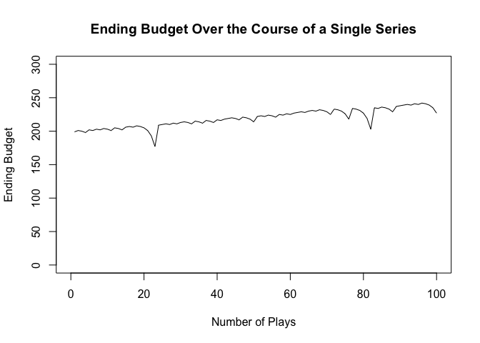
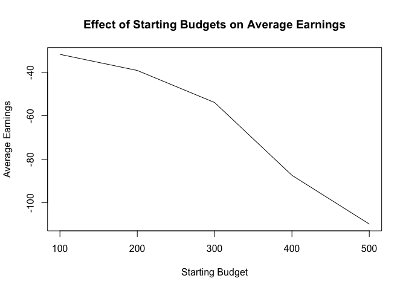

## How does Roulette work?

Roulette is a popular casino game that involves a spinning wheel with
numbered pockets and a small ball. Players place bets on where they
think the ball will land once the wheel stops spinning. The roulette
wheel is divided into numbered pockets.There are 38 pockets of which 2
are green, 18 are red, and 18 are black. The numbers are not arranged in
numerical order on the wheel. Players place their bets on individual
numbers, groups of numbers, whether the number will be odd or even, red
or black, and other combinations.

## What is the “Martingale” strategy?

The strategy is based on the concept of doubling your bet after every
loss in order to recover previous losses and potentially make a profit.
The player starts by placing an initial bet on an outcome. If the
player’s initial bet wins, they collect their winnings and start again
with the original bet amount.If the player’s initial bet loses, they
double their bet for the next round. If the player continues to lose,
they keep doubling their bet after each loss until they eventually win.
When the player finally wins a bet, they recover all of their previous
losses plus the original bet amount. After a win, the player starts
again with the initial bet amount.

## To better understand how successful the Martingale strategy tends to be we will be utillizing the following simulation:

    martingale_wager <- function(previous_wager, previous_outcome, max_wager, current_budget) {
      if(previous_outcome == 1) return(1)
      min(2 * previous_wager, max_wager, current_budget)
    }

    profit <- function(l1) {
      l1[nrow(l1), 4] - l1[1, 1]
    }

    one_series <- function(ng, sb, wt, mw) {
      l1 <- matrix(NA_integer_, nrow = ng, ncol = 4)
      l1[, 3] <- rbinom(ng, 1, 18 / 38)
      l1[1, 1] <- sb
      l1[1, 2] <- 1
      l1[1, 4] <- ifelse(l1[1, 3] == 1, sb + 1, sb - 1)

      for (i in 2:ng) {
        w <- martingale_wager(l1[i - 1, 2], l1[i - 1, 3], mw, l1[i - 1, 4])
        e <- ifelse(l1[i, 3] == 1, l1[i - 1, 4] + w, l1[i - 1, 4] - w)
        s <- e <= 0 | e >= wt
        l1[i, c(1, 2, 4)] <- c(l1[i - 1, 4], w, e)
        if (s) break
      }
      l1[1:i, ]
    }

    ending_budget <- one_series(100, 200, 300, 100)[, 4]
    plot(ending_budget, type = "l", xlim = c(0, 100), ylim = c(0, 300), xlab = "Number of Plays", ylab = "Ending Budget", main = "Ending Budget Over the Course of a Single Series")

    average_earnings <- replicate(1000, one_series(1000, 200, 300, 100) |> profit()) |> mean()
    print(paste("Average Earnings over 1000 simulations:", round(average_earnings, 2)))

    ## [1] "Average Earnings over 1000 simulations: -47.16"

    # Define the functions

    # Function to calculate the next wager based on the Martingale betting strategy.
    # It takes the previous wager, previous outcome, maximum wager allowed, and current budget as inputs.
    martingale_wager <- function(previous_wager, previous_outcome, max_wager, current_budget) {
      # If the previous outcome was a win, return a minimum wager of 1.
      if (previous_outcome == 1) return(1)
      # Otherwise, calculate the next wager as the minimum of 2 times the previous wager,
      # the maximum allowed wager, and the current budget.
      min(2 * previous_wager, max_wager, current_budget)
    }

    # Function to calculate the profit earned in a gambling series.
    # It takes a matrix representing the gambling results as input.
    profit <- function(l1) {
      # Calculate the difference between the ending budget of the last round
      # and the starting budget of the first round.
      l1[nrow(l1), 4] - l1[1, 1]
    }

    # Function to simulate a single series of gambling.
    # It takes parameters such as the maximum number of spins, starting budget, winning threshold, and maximum wager allowed.
    one_series <- function(ng, sb, wt, mw) {
      # Initialize a matrix to store the results of each round of gambling.
      l1 <- matrix(NA_integer_, nrow = ng, ncol = 4)
      # Generate random outcomes for each round (win or loss).
      l1[, 3] <- rbinom(ng, 1, 18 / 38)
      # Set the starting budget.
      l1[1, 1] <- sb
      # Set the initial wager to 1.
      l1[1, 2] <- 1
      # Calculate the ending budget after the first round.
      l1[1, 4] <- ifelse(l1[1, 3] == 1, sb + 1, sb - 1)

      # Iterate over each round of gambling.
      for (i in 2:ng) {
        # Calculate the next wager using the Martingale strategy.
        w <- martingale_wager(l1[i - 1, 2], l1[i - 1, 3], mw, l1[i - 1, 4])
        # Calculate the ending budget after the current round.
        e <- ifelse(l1[i, 3] == 1, l1[i - 1, 4] + w, l1[i - 1, 4] - w)
        # Check if the ending budget meets the winning threshold or is exhausted.
        s <- e <= 0 | e >= wt
        # Update the matrix with the results of the current round.
        l1[i, c(1, 2, 4)] <- c(l1[i - 1, 4], w, e)
        # If the winning threshold is reached or the budget is exhausted, end the simulation.
        if (s) break
      }
      # Return the matrix representing the results of the simulation.
      l1[1:i, ]
    }

    # Simulate a single series and plot the ending budget over the course of the series.
    ending_budget <- one_series(100, 200, 300, 100)[, 4]
    plot(ending_budget, type = "l", xlim = c(0, 100), ylim = c(0, 300), xlab = "Number of Plays", ylab = "Ending Budget", main = "Ending Budget Over the Course of a Single Series")

    # Calculate the average earnings using default parameter settings.
    average_earnings <- replicate(1000, one_series(1000, 200, 300, 100) |> profit()) |> mean()
    print(paste("Average Earnings over 1000 simulations:", round(average_earnings, 2)))

    ## [1] "Average Earnings over 1000 simulations: -48.2"

## Simulation Explained: The code for this simulation can be explained by dividing it into three chunks. The first chunk is the function martingale\_wager. This function determine the size of the next wager based on the result of the previous wager. For instance, if the previous outcome was a win then the next wager will be the original wager(1), else it will be twice the last wager. The second chunk is the profit function which determines the profit by taking the ending budget and subracting the initial budget from it. the opne series function simulates a single series of gambling. It takes parameters such as the maximum number of spins, starting budget, winning threshold, and maximum wager allowed. It initializes a matrix to store the results of each round of gambling and generates random outcomes for each round. It then iterates over each round, calculating the next wager using the Martingale strategy and updating the ending budget accordingly. The simulation continues until the winning threshold is reached or the budget is exhausted.After defining the functions, the code simulates a single series of gambling and plots the ending budget over the course of the series. The x-axis represents the number of plays, and the y-axis represents the ending budget. Additionally, the code calculates the average earnings over 1000 simulations using default parameter settings and prints out the result.

## Now, let us examine how changing the parameters effects the average earnings.

    # ex. Starting Budget

    # get a range of starting budgets
    starting_budgets <- seq(100, 500, by = 100)

    # create a vector to store the average earnings for each starting budget
    # make it the length of the starting budgets we are looping over
    ae <- numeric(length(starting_budgets))

    # create a for loop, going through each starting budget value
    for(i in 1:length(starting_budgets)){
      # replicate 1000 times with these settings, changing the starting budget each time
      # winning threshold is 100 more than the starting budget each time
      # could also just set winning threshold to be a large number that starting budget
      # never goes over
      # ae[i] stores the average earning in the ith place
      # starting_budgets[i] selects the ith starting budget to use for this loop
      ae[i] <- replicate(1000, one_series(1000, 
                                          starting_budgets[i], 
                                          starting_budgets[i] + 100, 
                                          100) |> profit()) |> mean()
    }

    # now plot the results
    # starting budget on the x-axis, average earnings on the y-axis

    plot(starting_budgets, ae, 
         main = 'Effect of Starting Budgets on Average Earnings',
         ylab = 'Average Earnings',
         xlab = 'Starting Budget',
         type = 'l')

## This code analyzes how different starting budgets impact average earnings in a gambling scenario. It simulates 1000 gambling scenarios for starting budgets ranging from 100 to 500, incrementing by 100. Then, it calculates the average earnings for each starting budget and plots the relationship between them.

## The code below has been modified to calculate the average number of plays before stopping. We introduce a counter variable called plays to keep track of the number of plays and it is incremented with each iteration of the loop. After running multiple simulations, the average number of plays before stopping is calculated by dividing the total number of plays by total simulations. The output is printed.

    one_series <- function(ng, sb, wt, mw){
    # ng = max number of spins
    # sb = starting budget
    # wt = ending budget (starting budget + winning threshold)
    # mw = max wager
      l1 <- matrix(NA_integer_,nrow=ng,ncol=4)
      l1[,3] <- rbinom(ng,1,18/38)
      l1[1,1] <- sb
      l1[1,2] <- 1
      l1[1,4] <- ifelse(l1[1,3]==1, sb + 1, sb - 1)

      plays<-1
      for(i in 2:ng){
        w <- martingale_wager(l1[i-1,2], l1[i-1,3], mw, l1[i-1,4])
        e <- ifelse(l1[i,3]==1, l1[i-1,4] + w, l1[i-1,4] - w)
        s <- e <= 0 | e >= wt
        l1[i,c(1,2,4)] <- c(l1[i-1,4], w, e)
        if(s) break
        plays<-plays+1
      }
      return(plays)
    }

    num_simulations <- 1000  # Number of simulations
    total_plays <- 0

    for (sim in 1:num_simulations) {
      total_plays <- total_plays + one_series(100, 200, 300, 100)
    }

    average_plays <- total_plays / num_simulations
    cat("Average number of plays before stopping:", average_plays, "\n")

    ## Average number of plays before stopping: 88.916

## It is safe to say that the simulation and the Martingale strategy has its shortcomings. The biggest limitation, in my opinion, is that it relies on the gambler to have an unlimited bank roll to cover his losses. The strategy fails when the gambler eventually loses all his money and is unable to cover his losses. The risk increases exponentially with every loss. The strategy relies on the gambler’s discipline and ability to leave the game after his budget runs out or he hits his winning threshold. Furthermore, the strategy doesn’t change the odds of the game in any way as each spin is an independent event. It should also be noted that the strategy doesn’t account for varied odds due to the participation of other gamblers, etc.
