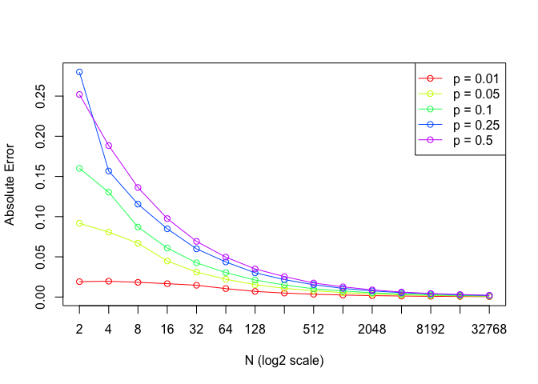
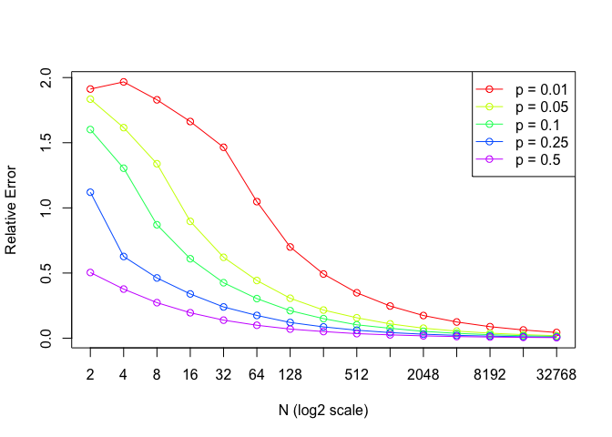

## Simulation Error:

### Simulation generates approximate answers; there is some degree of error in a quantity estimated by Monte Carlo simulation. Intuitively, it seems that the degree of error should get smaller as the number of simulation replicates increases. For the purpose of this simulation we will be lookking at absolute and relative errors. Absolute error measures the magnitude of the difference between the estimated or observed value and the true or expected value. ae &lt;- abs(phat - p) where ae is the absolute error, abs is the absolute value function, phat is the estimated probability based on the information and p is the true value. On the other hand, relative error measures the proportion or ratio of the absolute error to the true value. re &lt;- ae / p where re is the relative error.

### The following code allows us to perform a 14 X 5 factorial experiment simulation that estimates the error for each combination of replicate number (22, 23, …, 215) and probability (0.01, 0.05, 0.10, 0.25, 0.50). The results are visualized in the graphs below and the x axis(N) is on the log base 2 scale.

    error_v4 <- function(r, n, p){
      d1 <- rbinom(r, n, p)
      phat <- d1 / n
      ae <- abs(phat - p)
      re <- ae / p
      c(mean(ae), mean(re))
    }

    # Initialize an empty data frame to store the results
    results <- data.frame(n = numeric(), p = numeric(), ae = numeric(), re = numeric())

    # Set up parameters for the experiment
    r <- 5000  # Constant replicate number
    probs <- c(0.01, 0.05, 0.10, 0.25, 0.50)
    ni <- 2^seq(1, 15, by = 1)

    # Loop through each combination of number of trials (n) and probability
    for (p in probs) {
      for (n in ni){
        # Calculate errors using error_v4 function
       errors <- error_v4(r, n, p)
      
      # Store the results in the data frame
        results <- rbind(results, data.frame(n = n, p = p, ae = errors[1], re = errors[2]))
      }
    }

    ae_results <- results[, c("n", "p", "ae")]
    re_results <- results[, c("n", "p", "re")]

    plot(NULL, xlim = range(results$n), ylim = range(results$ae),
         xlab = "N (log2 scale)", ylab = "Absolute Error", log = "x", xaxt = "n")

    palette <- rainbow(length(unique(results$p)))

    for (i in 1:length(unique(results$p))) {
      p_subset <- subset(results, p == unique(results$p)[i])
      lines(p_subset$n, p_subset$ae, type = "o", col = palette[i], log = "x")
    }

    legend("topright", legend = paste("p =", unique(results$p)), col = palette, lty = 1, pch = 1)

    axis(1, at = unique(results$n), labels = unique(results$n))

    plot(NULL, xlim = range(results$n), ylim = range(results$re),
         xlab = "N (log2 scale)", ylab = "Relative Error", log = "x", xaxt = "n")

    palette <- rainbow(length(unique(results$p)))

    for (i in 1:length(unique(results$p))) {
      p_subset <- subset(results, p == unique(results$p)[i])
      lines(p_subset$n, p_subset$re, type = "o", col = palette[i], log = "x")
    }

    legend("topright", legend = paste("p =", unique(results$p)), col = palette, lty = 1, pch = 1)

    axis(1, at = unique(results$n), labels = unique(results$n))

### Explanation: Evidently the relative and absolute error decreases as you increase the number of trials. To fully understand the reasoning behind this it is important to understand the law of large numbers. The law of large numbers states that as the number of independent trials (N) increases, the sample mean of those trials will converge to the true population mean. In the context of our experiment, as N increases, the estimated probability (phat) based on the sample tends to get closer to the true underlying probability (p). With more data points, the estimates become more accurate, reducing both absolute and relative errors. Additionally, larger sample sizes tend to provide more stable and reliable estimates, leading to smaller errors.

### Looking closer at the two graphs, we can observe that the order of the probabilities is flipped. For instance, the line for the probability 0.1 is almost flat for the absolute error graph, but starts closer to the highest point of the graph(2.0) on the y-axis for the relative error graph. This can be explained by going back to the formulas for each. ae &lt;- p*-p and re &lt;- (p*-p)/ p. There are two factors which explain the switched order of probabilities in the two graphs: magnitude of probabilities and variance.

1.  Magnitude of the probabilities effects the errors in a significant
    way. Smaller probability values will translate into a larger
    relative error and a smaller absolute error. Likewise, larger
    probability values will translate into a smaller relative error and
    a larger absolute value. This is due to the calculation of relative
    error involving division by the true value of p. When this value of
    p is small it will yield a larger relative error compared to the
    absolute error. This also explains why we get a much larger range of
    values for relative error compared to absolute error.

2.  Variance also plays an important role in the difference in error
    values between the two graphs. Variance is calculated as p \* (1-p).
    As values of probability increase from 0.01 to 0.5, the variance
    increases. As variance increases you can expect to get much larger
    values for absolute error as there is a greater difference between
    the calculated value of p\* and the true value of p. In the case of
    calculating relative error, this is offset by the denominator which
    is the real value of p. 
