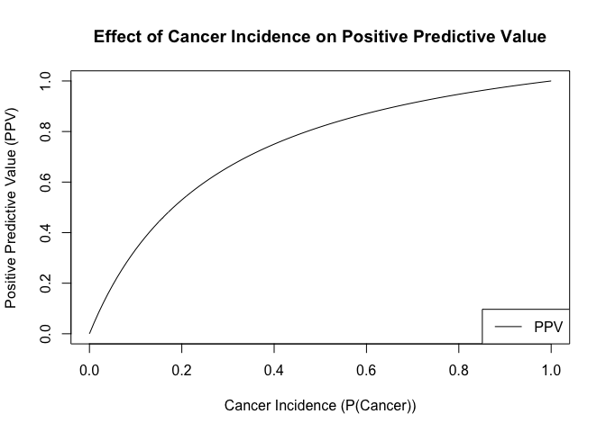

## HW 11

1.  

<table>
<colgroup>
<col style="width: 47%" />
<col style="width: 20%" />
<col style="width: 21%" />
<col style="width: 10%" />
</colgroup>
<thead>
<tr class="header">
<th></th>
<th>Cancer</th>
<th>Not Cancer</th>
<th>Total</th>
</tr>
</thead>
<tbody>
<tr class="odd">
<td><strong>Test= + </strong></td>
<td>ptp</td>
<td>(1-p)(1-tn)</td>
<td>ptp + (1-p)(1-tn)</td>
</tr>
<tr class="even">
<td>    Row</td>
<td>ptp/(ptp+(1-p)(1-tn))</td>
<td>(1-p)(1-tn)/(ptp+(1-p)(1-tn))</td>
<td></td>
</tr>
<tr class="odd">
<td>    Col</td>
<td>tp</td>
<td>1-tn</td>
<td></td>
</tr>
<tr class="even">
<td><strong>Test= - </strong></td>
<td>p(1-tp)</td>
<td>tn(1-p)</td>
<td>p(1-tp)+tn(1-p)</td>
</tr>
<tr class="odd">
<td>    Row</td>
<td>p(1-tp)/(p(1-tp)+tn(1-p))</td>
<td>tn(1-p)/(p(1-tp)+tn(1-p))</td>
<td></td>
</tr>
<tr class="even">
<td>    Col</td>
<td>1-tp</td>
<td>tn</td>
<td></td>
</tr>
<tr class="odd">
<td>Total</td>
<td>p</td>
<td>1-p</td>
<td>1</td>
</tr>
</tbody>
</table>

1.  P(Cancer|+) = ptp/(ptp+(1-p)(1-tn)) =
    (0.01*0.9)/((0.01*0.9)+(1-0.01)(1-0.8)) = 0.009/0.191 = 0.047

2.  

<!-- -->

    calculate_ppv <- function(cancer_incidence) {
      sensitivity <- 0.9
      specificity <- 0.8
      ppv <- sensitivity * cancer_incidence / (sensitivity * cancer_incidence + (1 - specificity) * (1 - cancer_incidence))
      return(ppv)
    }

    cancer_incidence <- seq(0, 1, by = 0.01)

    ppv_values <- sapply(cancer_incidence, calculate_ppv)

    plot(cancer_incidence, ppv_values, type = "l",
         xlab = "Cancer Incidence (P(Cancer))", ylab = "Positive Predictive Value (PPV)",
         main = "Effect of Cancer Incidence on Positive Predictive Value",
         ylim = c(0, 1))

    legend("bottomright", legend = "PPV", col = "black", lty = 1)

