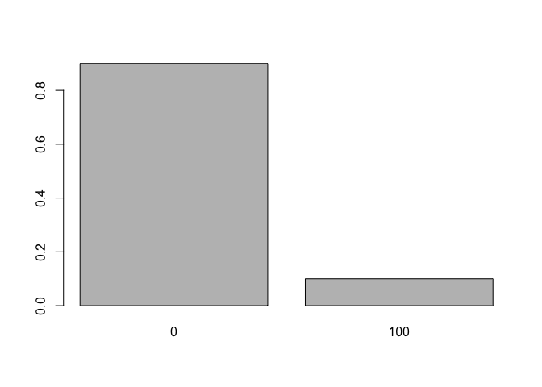
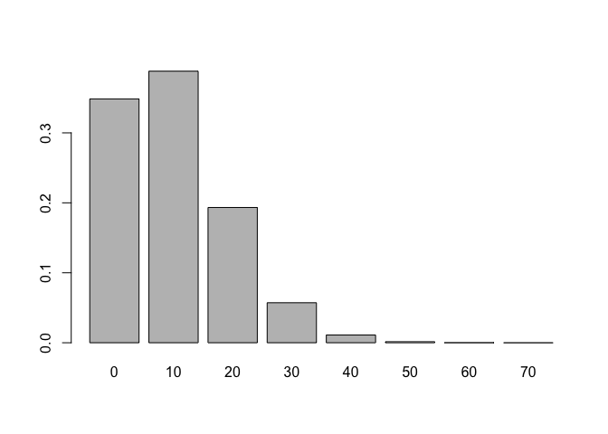

    big_well <- function(N) 100*rbinom(N, 1, 0.1)
    sma_well <- function(N)  10*rbinom(N, 10, 0.1)
    set.seed(23459874)

## 1. Write code that generates long run proportions for the small well investment opportunity.

    sma_well(1E6) |>
      table() |>
      proportions()

    ## 
    ##        0       10       20       30       40       50       60       70 
    ## 0.348899 0.387349 0.193525 0.057437 0.011152 0.001483 0.000143 0.000011 
    ##       80 
    ## 0.000001

## 2a. Create a figure which visualizes the long-run proportions for the big well investment opportunity.

    (big_well(1E6) |>
      table() |>
      proportions())

    ## 
    ##        0      100 
    ## 0.900081 0.099919

    barplot(big_well(1E6) |>
      table() |>
      proportions())

## 2b.Create a figure which visualizes the long-run proportions for the small well investment opportunity.

    barplot(sma_well(1E6) |>
      table() |>
      proportions())

## 3. In section 3.9, the author introduces the notation p(E|K). What does K represent?Create an example where the probability of an event is different when K is different.

K denotes our knowledge base and refers to how our knowledge of a
certain event can lead to a change in our percieved uncertainty of a
situation. For instance, if there is a horse race at 2:30 and we are
considering whether a horse will win, if we have prior knowledge as to
who the jockey is, who the trainer is, the horse’s track record etc, our
uncertainty will change.

## 4. If E denotes an event, what does E^c denote?

If E denotes an event, then E complement denotes th eopposite of that
event or any other possible outcomes other than the E.

## 5. Consider a potentially unfair six-sided die. Let E denote the outcome of a die roll. If P(E is even )=.6, what must P(E is odd ) be? Why?

If P(E is even) is .6 then P(E is odd) will be 0.4. This is because
P(E)+P(E^c)=1
