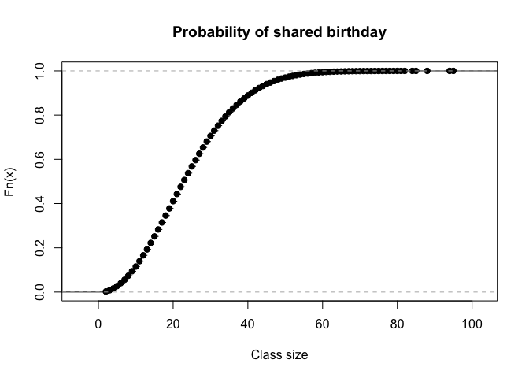

## 1. Using simulation, create a script that will solve the following riddle.

    generate_class <- function(class_size){

       sample(1:365, class_size, replace=TRUE)

    }
     
    check_birthday <- function(birthday_roster){

      birthday_roster |> duplicated() |> any()

    }

    set.seed(230583)

    R <- 100000

    replicates <- replicate(R, generate_class(45) |> check_birthday())
    mean(replicates)

    ## [1] 0.94017

## 2. What does set.seed do in the script?

Set.seed ensures that the random numbers can be reproduced.

## 3. What does R represent?

R represents the number of replicates that will be performed.

## 4. Does the solution make any assumptions or simplifications? If so, what are they?

The solution assumes that birthdays are uniformly distributed and that
each day has an equal possibility of being someone’s birthday. It also
ignores leap years.

## 5.Run both versions of the script. For version 1, use a class size of 28. Do both versions give the same answer?

    generate_class <- function(class_size){

       sample(1:365, class_size, replace=TRUE)

    }
     
    check_birthday <- function(birthday_roster){

      birthday_roster |> duplicated() |> any()

    }

    set.seed(230583)

    R <- 100000

    replicates <- replicate(R, generate_class(28) |> check_birthday())
    mean(replicates)

    ## [1] 0.6539

    first_duplicate <- function(){
        sample(1:365, 366, replace=TRUE) |>
        duplicated() |>
        which() |>
        min()
    }

    fd1 <- replicate(R, first_duplicate())
    plot(ecdf(fd1), main = "Probability of shared birthday", xlab = "Class size")

 Both
versions approximately give the same answer

## 6. Add vertical and horizontal lines to the plot generated in version 2 which show your estimated probability generated with version 1 code.

    estimated_probability<-mean(replicates)
    plot(ecdf(fd1), main = "Probability of shared birthday", xlab = "Class size")

    abline(h = estimated_probability, col = "blue")

## 7.Look at the first\_duplicate function. What does the function return? Use ?which and ?min to read the documentation of what these commands do. (Answer: It returns the first instance of \_\_\_\_\_.)

The first\_duplicate function returns the index of the first instance of
a duplicated element in the vector of birthdays. Which() is used to
return the indices of duplicated birthdays which are true and min()
returns the smallest of these indices which is the first duplicated
birthday.
