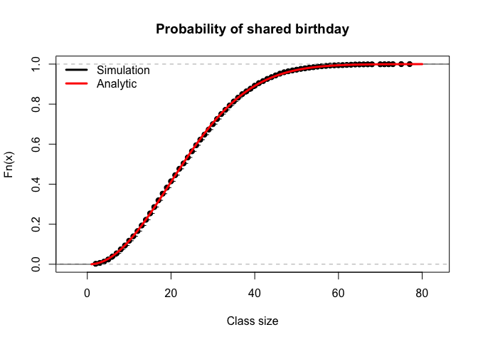

## What is the probability that the series ends in 5 or 6 games?

The probability of the game ending in 5 or 6 games is the cell
probability that corresponds with 5a, 5b, 6a, 6b. This is 0.08 + 0.18 +
0.11 + 0.19= 0.56

## What is the probability that team A will win supposing the series ends in 6 games?

This is a conditional probability P(A wins|ends in 6 games).
0.11/(0.11+0.19)= 0.3666667

## What is the probability that team B wins the series or that the series will end after an even number of games?

This is the probability of the column B + even numbered games in column
A(4,6). The probability is 0.79.

## What is the probability the series will end in 5 or fewer games supposing that A wins the series?

This is a conditional probability = P(ends in 4 or 5 games|A wins) =
0.3142857

## In section 5.5, the author provides an analytic solution to the birthday problem. Calculate the shared birthday probability analytically for a class of size 11. How does the value compare with the solution you generated computationally in hw6? (Copy/run your code from HW6 to empirically compute the solution.)

The author uses the following formula: P(Atleast one shared birthday in
a class of size k)= 1-365!/((365-k)365^k) We will alter the formual
using logs and exponents to make it possible for our computers to be
able to work it out. We will use the lfactorial command

    birthday_prob <- function(k) 1 - exp(lfactorial(365) - lfactorial(365-k) - k*log(365))
    birthday_prob(11)

    ## [1] 0.1411414

Comparing our code from hw6 with our analytical simulation:

    first_duplicate <- function(){
        sample(1:365, 366, replace=TRUE) |>
        duplicated() |>
        which() |>
        min()
    }

    R <- 10000
    fd1 <- replicate(R, first_duplicate())
    plot(ecdf(fd1), main = "Probability of shared birthday", xlab = "Class size")

    class_sizes <- 1:80
    analytic_birthday_prob <- birthday_prob(class_sizes)
    lines(class_sizes, analytic_birthday_prob, col = "red", lwd = 3)
    legend("topleft", legend = c("Simulation","Analytic"), col = c("black","red"), lwd = 3, bty = "n")

 We observe
that there is nearly no difference in both solutions.
