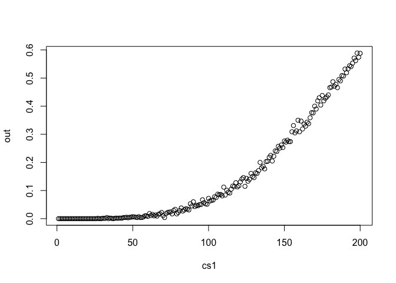

## \## 1

\##title: “Probability of shared birthday” \##output: md\_document —

## \`\`\`{r birthday-probs}

\##first\_duplicate &lt;- function(){ \## sample(1:365, 366,
replace=TRUE) |&gt; \## duplicated() |&gt; \## which() |&gt; \## min() }

\##R &lt;- 10000 \##fd1 &lt;- replicate(R, first\_duplicate())
\##plot(ecdf(fd1), main = “Probability of shared birthday”, xlab =
“Class size”)

## 2: This is because the output files generated by script.rmd were not saved in the project folder. One way to fix this would be to change the working directory.

## 3: The final line of this code adds an image to the md file.  adds the image and the rest is the path to the file.

## 4: You can get the script to save the output files within the directory and view the images from there.

## 5 :The error message indicates that the R script or function is attempting to load the ‘data.table’ package, but the package is not installed on the system. This can be solved by installing and loading the package.

## 6: Probability is the strength of your belief relating to an event. For instance:

1.  Trump will win the 2024 Election. This probability can depend on a
    variety if factors and can be gauged through polls etc.
2.  AI will take over the world. This is more like an opinion but can
    also depend on many factors.
3.  I am 6 feet tall.(This is a different type of uncertainty as it
    doesn’t have to do with the future and can be verified through any
    measuring tape, etc).
4.  Flipping a fair coin, the probability of getting heads or tails is
    equally possible. There is no knowledge which can update our
    probability in this scenario.

## 7:

<table>
<thead>
<tr class="header">
<th style="text-align: left;"></th>
<th style="text-align: center;">A</th>
<th style="text-align: center;">B</th>
<th style="text-align: center;">C</th>
<th style="text-align: center;"></th>
</tr>
</thead>
<tbody>
<tr class="odd">
<td style="text-align: left;">Defective</td>
<td style="text-align: center;">0.175</td>
<td style="text-align: center;">0.035</td>
<td style="text-align: center;">0.007</td>
<td style="text-align: center;">.217</td>
</tr>
<tr class="even">
<td style="text-align: left;">→ cell</td>
<td style="text-align: center;"></td>
<td style="text-align: center;"></td>
<td style="text-align: center;"></td>
<td style="text-align: center;"></td>
</tr>
<tr class="odd">
<td style="text-align: left;">→ row</td>
<td style="text-align: center;"></td>
<td style="text-align: center;"></td>
<td style="text-align: center;"></td>
<td style="text-align: center;"></td>
</tr>
<tr class="even">
<td style="text-align: left;">→ col</td>
<td style="text-align: center;"></td>
<td style="text-align: center;"></td>
<td style="text-align: center;"></td>
<td style="text-align: center;"></td>
</tr>
<tr class="odd">
<td style="text-align: left;">Functional</td>
<td style="text-align: center;">0. 396</td>
<td style="text-align: center;">.250</td>
<td style="text-align: center;">.135</td>
<td style="text-align: center;">.783</td>
</tr>
<tr class="even">
<td style="text-align: left;">→ cell</td>
<td style="text-align: center;"></td>
<td style="text-align: center;"></td>
<td style="text-align: center;"></td>
<td style="text-align: center;"></td>
</tr>
<tr class="odd">
<td style="text-align: left;">→ row</td>
<td style="text-align: center;"></td>
<td style="text-align: center;"></td>
<td style="text-align: center;"></td>
<td style="text-align: center;"></td>
</tr>
<tr class="even">
<td style="text-align: left;">→ col</td>
<td style="text-align: center;"></td>
<td style="text-align: center;"></td>
<td style="text-align: center;"></td>
<td style="text-align: center;"></td>
</tr>
<tr class="odd">
<td style="text-align: left;"></td>
<td style="text-align: center;">4/7</td>
<td style="text-align: center;">2/7</td>
<td style="text-align: center;">1/7</td>
<td style="text-align: center;">1</td>
</tr>
</tbody>
</table>

## 8: P(A):4/7

## 9: P(A|D): 0.175

## 10:

## 11:

## 12,13:

    generate_class <- function(class_size){
      sample(1:365,class_size,replace=TRUE)
    }

    check_birthday <- function(class){
      tb1<-table(class)
      any(tb1>=4)
    }

    set.seed(230583)
    R <- 100
    replicates <- replicate(R, generate_class(55)|>check_birthday())
    mean(replicates)

    ## [1] 0

    R<-1000
    cs1<-1:200
    out<-cs1*0
    for(j in 1:200){
      replicates <- replicate(R, generate_class(j)|>check_birthday())
      out[j]<-mean(replicates)
    }

    plot(cs1,out)

